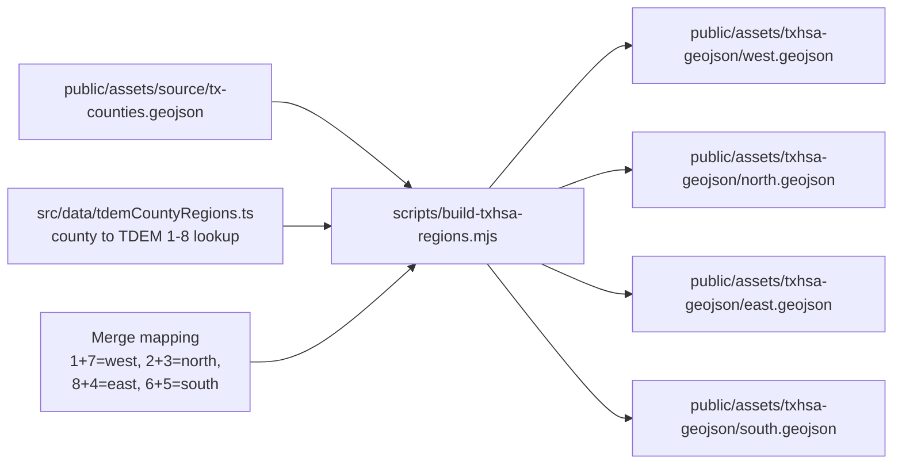
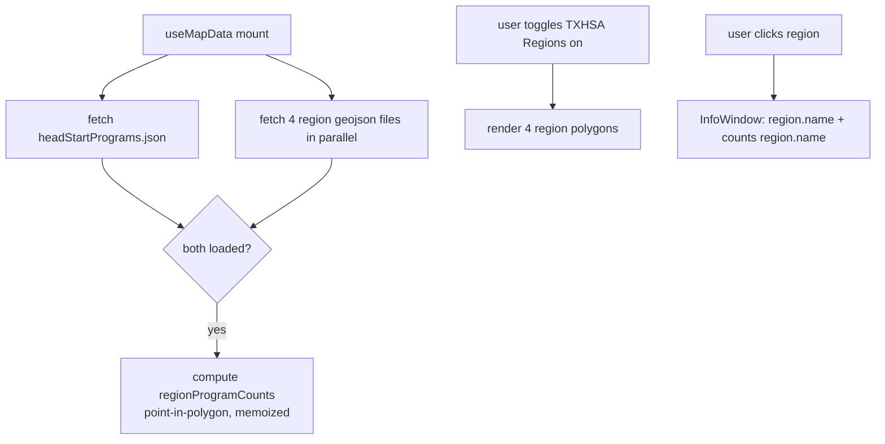

# feat: Replace District Boundaries overlay with TXHSA Regions

## Summary

Replace the 36-polygon Congressional District overlay with a 4-polygon TXHSA Regions overlay (west/north/east/south) by building the region geojson at repo-build time via a one-time dissolve script over a committed Texas-counties source and a committed county→TDEM-region lookup table. The four polygons are loaded at runtime like any other static asset; clicking a region opens an info window with the region name and a lazily-computed count of Head Start / Early Head Start programs whose coordinates fall inside it. The prior district stack — Congress.gov API client, representative-name search branch, district info card, district types, and all 36 `TX-{N}/shape.geojson` directories — is removed in the same change.

---

## Problem Frame

The brainstorm establishes the user-facing motivation (see origin: `docs/brainstorms/txhsa-regions-overlay-requirements.md` Problem Frame). At the implementation level, the work spans three concerns that need careful sequencing: a new build-time data pipeline (counties + lookup → dissolved regions), a UI surface rename and rewiring (toggle, info window, search), and a cleanup of the district stack that must happen *after* the new code is wired so the deletion doesn't break references mid-change.

---

## Requirements

- R1. Four geojson files produced at `public/assets/txhsa-geojson/{west,north,east,south}.geojson`, each a single Polygon or MultiPolygon feature with a `name` property (`"West"`, `"North"`, `"East"`, `"South"`). *(origin R1)*
- R2. Region geometry built by assigning each Texas county to one of the eight TDEM regions per `public/images/tdem-8-regions.png`, then dissolving counties. *(origin R2)*
- R3. Merge mapping is fixed: `west` = TDEM 1+7; `north` = 2+3; `east` = 8+4; `south` = 6+5. *(origin R3)*
- R4. Dissolved polygons follow Texas county boundaries with no gaps and no overlap between adjacent regions. *(origin R4)*
- R5. Toggle label is "TXHSA Regions"; `title` attribute and ARIA labels updated to match. *(origin R5)*
- R6. `LayerVisibility.districtBoundaries` renamed to `LayerVisibility.txhsaRegions`; all references updated. *(origin R6)*
- R7. Default toggle state is OFF; toggling on renders all four polygons, off renders none. *(origin R7)*
- R8. Four regions are visually distinguishable; styling consistent with the existing design system. *(origin R8)*
- R9. Region info window shows region name and the count of Head Start / Early Head Start programs inside. *(origin R9)*
- R10. Program counts computed via point-in-polygon against region geometry; each program counted in exactly one region. *(origin R10)*
- R11. Region info card contains no representative, party, photo, contact, or committee field. *(origin R11)*
- R12. Congress.gov API integration removed (`src/api/congress.ts`, `loadCongressionalData`, `getCongressApiKey` and its env-var branch, any `CongressDataDebug` imports). *(origin R12)*
- R13. Representative-name / district-number search branch removed from `src/hooks/useSearch.ts`. *(origin R13)*
- R14. All 36 `public/assets/geojson/TX-{1..36}/` directories deleted. *(origin R14)*
- R15. `VITE_CONGRESS_API_KEY` removed from `CLAUDE.md` and validator code; absent from any `.env.example`. *(origin R15)*
- R16. Congressional district types deleted from `src/types/maps.ts`; `src/data/congressionalDistricts.ts` deleted; new TXHSA region types added. *(origin R16)*
- R17. Tests that exercised the district overlay, Congress.gov integration, or representative search updated or removed; new test coverage added for the region overlay and info card. *(origin R17)*

**Origin acceptance examples:** AE1 (covers R5, R7), AE2 (covers R7), AE3 (covers R9, R10), AE4 (covers R10), AE5 (covers R11), AE6 (covers R13).

---

## Scope Boundaries

- The un-merged 8-region overlay is not built — only the merged four polygons ship. *(origin)*
- Per-county or sub-region granularity is not exposed — no drill-down from a region to its counties. *(origin)*
- No drill from a region to the list of programs inside it; the info window shows a count, not a list. *(origin)*
- No region-name search feature is added; if region names happen to fall out of existing program-search infrastructure that is fine but not required. *(origin)*
- The overlay does not surface TXHSA-specific program data, demographics, funding totals, or population statistics — only the program count. *(origin)*
- No feature flag or dormant code path preserves the 36-district overlay. *(origin)*

---

## Context & Research

### Relevant Code and Patterns

- `src/hooks/useMapData.ts` — central data loader; current district-loading logic (`loadCongressionalDistricts`, `loadCongressionalData`) is the template for the new `loadTxhsaRegions` with a different fan-out (4 files, no API enrichment).
- `src/components/MapControls.tsx:249-286` — existing toggle pattern (Eye/EyeOff icons, Tailwind transitions, `aria-pressed`); the new TXHSA Regions toggle replaces this block in place.
- `src/components/TexasMap.tsx` — Map / Polygon / InfoWindow composition; `renderDistrictInfoWindow` at line 360 is replaced by a region info window with name + count.
- `src/data/congressionalDistricts.ts:173-223` — `isPointInPolygon`, `isPointInSinglePolygon`, `isPointInMultiPolygon` — ray-casting utilities that the plan migrates to a shared `src/utils/geometry.ts` before deleting the file.
- `src/types/maps.ts:75-84, 86-125, 162-194, 196-269` — Layer visibility, district types, Congress API types — all targeted for either rename (LayerVisibility) or deletion (district + Congress types).
- `src/data/headStartPrograms.ts` — pattern for processing geojson data + validation; mirrored by a new `src/data/txhsaRegions.ts`.
- `tailwind.config.js` + `src/styles/design-system.css` — design tokens use `--tx-blue-*` / `--tx-orange-*` CSS variables; new `--txhsa-{west,north,east,south}` tokens follow the same shape.
- `jest.config.js` — ts-jest + jsdom; tests colocated with sources as `*.test.tsx` / `*.test.ts`.

### Institutional Learnings

- No `docs/solutions/` entries exist yet in this repo, so no prior learnings to draw on.

### External References

- TDEM regions reference: https://tdem.texas.gov/regions (also the source of `public/images/tdem-8-regions.png`).
- US Census TIGER cartographic boundary files (counties, 1:500k) are the standard accurate source for Texas county geojson when no in-repo source exists.
- mapshaper (https://github.com/mbloch/mapshaper) — industry-standard CLI for one-time geojson dissolves; `@turf/dissolve` is the JS equivalent if a Node-only pipeline is preferred.

---

## Key Technical Decisions

- **Build-time dissolve, not runtime.** A one-time Node script reads the county geojson + the county→TDEM-region lookup, applies the 4-way merge from R3, dissolves, and writes the four final files to `public/assets/txhsa-geojson/`. The four files are committed to the repo. Runtime dissolves over ~254 counties would be slow, brittle, and would couple every page load to a large source file the app doesn't otherwise need.
- **The build script lives in-repo at `scripts/build-txhsa-regions.mjs`.** Keeping it in-repo makes the pipeline reproducible (any maintainer can regenerate the files after a county-list update) and discoverable (the dissolve logic is auditable next to its output). Trade-off: the repo now has one Node `scripts/` entry it didn't have before.
- **Lazy, memoized point-in-polygon for program counts.** Counts are computed once on first overlay-on (or once when both regions and programs are loaded, whichever is later) and cached in `useMapData` state as `regionProgramCounts: { west: number; north: number; east: number; south: number }`. ~80 programs × 4 polygons = ~320 PIP tests, trivial on a modern device; pre-computing offline would couple `headStartPrograms.json` to the regions data and add a build step that's not worth the cost.
- **Point-in-polygon utilities migrated, not rewritten.** The existing ray-casting helpers in `src/data/congressionalDistricts.ts` are moved to `src/utils/geometry.ts` (with the same names: `isPointInPolygon`, `isPointInSinglePolygon`, `isPointInMultiPolygon`) before the district file is deleted. They are already tested in spirit (by district behavior); explicit unit tests are added during the migration.
- **County→TDEM-region lookup as committed static data.** A single source-of-truth file at `src/data/tdemCountyRegions.ts` exports a `Record<string, 1|2|3|4|5|6|7|8>` mapping each Texas county name to its TDEM region number. The build script consumes this file. Sourcing approach at execution time: try TDEM publications first (tdem.texas.gov or open-data portal); fall back to transcribing the county labels visible in `public/images/tdem-8-regions.png`. The decision to commit it as TS rather than JSON lets the type system enforce the 1-8 value range.
- **Region color tokens follow the existing `tx-` pattern.** Add four CSS variables (`--txhsa-west`, `--txhsa-north`, `--txhsa-east`, `--txhsa-south`) in `src/styles/design-system.css` and extend `tailwind.config.js` with a `txhsa.{west,north,east,south}` color namespace. Specific hues are chosen during implementation; the only requirement is the four colors are visually distinguishable and pass WCAG AA on a white-ish basemap background.
- **`useMapData` keeps its shape.** The hook continues to expose `layerVisibility`, `toggleLayer`, and a loader-orchestration pattern. State key `districtBoundaries` is renamed to `txhsaRegions`; loading logic is replaced rather than extended.
- **`useSearch` drops the district dimension entirely.** The hook's signature changes from `(allPrograms, allDistricts, options)` to `(allPrograms, options)`. `filteredDistricts`, `findDistrictByNumber`, `getSearchResultsBounds`'s district branch are removed. `SearchResults.tsx` loses its district-rendering branch.

---

## Open Questions

### Resolved During Planning

- **Where do the 4 region polygons come from?** Build-time dissolve script over a committed county source + lookup table. See Key Technical Decisions.
- **Where do program counts come from?** Lazy, memoized point-in-polygon in `useMapData`. See Key Technical Decisions.
- **What happens to the `congressionalDistricts.ts` point-in-polygon utilities?** Migrated to `src/utils/geometry.ts` before deletion. See Key Technical Decisions.
- **What happens to `useSearch` after districts are removed?** District dimension dropped; hook signature changes. See Key Technical Decisions.

### Deferred to Implementation

- **Exact county geojson source file.** US Census TIGER 1:500k counties (filtered to Texas, state FIPS 48) is the recommended default; the actual file is acquired and committed under `public/assets/source/tx-counties.geojson` (or similar) during U1. License notice committed alongside if required by the source.
- **Specific dissolve tool inside the script.** `mapshaper` CLI driven from Node via `child_process`, or `@turf/dissolve` as a pure-Node alternative. Chosen during U1 based on which produces cleaner output on the chosen county source.
- **Specific hue values for the four region colors.** Chosen during U3 to be visually distinct and WCAG-AA-compliant against the map basemap.
- **Whether the county geojson source file is committed to the repo or fetched on demand by the build script.** Default: commit it for reproducibility; revisit if file size exceeds ~5 MB.
- **Whether to keep `CongressDataDebug.tsx` if it has any non-district uses.** Greppable check during U8 confirms it is district-only before deletion.

---

## High-Level Technical Design

> *This illustrates the intended approach and is directional guidance for review, not implementation specification. The implementing agent should treat it as context, not code to reproduce.*

**Build-time data flow** (runs once, committed output):

**Runtime data flow** (per session):

---

## Implementation Units

### U1. Build the TXHSA region geojson via a one-time dissolve script

**Goal:** Produce the four authoritative region geojson files in `public/assets/txhsa-geojson/` by dissolving Texas counties grouped per the TDEM-8 mapping and committed county→region lookup.

**Requirements:** R1, R2, R3, R4

**Dependencies:** None

**Files:**
- Create: `scripts/build-txhsa-regions.mjs`
- Create: `src/data/tdemCountyRegions.ts` (county→TDEM 1-8 lookup; type `Record<string, 1|2|3|4|5|6|7|8>`)
- Create: `public/assets/source/tx-counties.geojson` (Texas counties source; provenance noted in script header comment)
- Create: `public/assets/txhsa-geojson/west.geojson`
- Create: `public/assets/txhsa-geojson/north.geojson`
- Create: `public/assets/txhsa-geojson/east.geojson`
- Create: `public/assets/txhsa-geojson/south.geojson`
- Modify: `package.json` (add `build:regions` script entry)
- Test: `scripts/__tests__/build-txhsa-regions.test.mjs` (smoke test that dissolve produces expected 4-output count from a 4-county fixture; full integration is verified visually on the map)

**Approach:**
- Script reads the county source, attaches the TDEM region number to each county feature via the lookup, applies the merge mapping (1+7→west, 2+3→north, 8+4→east, 6+5→south) so each feature ends up tagged with one of the four TXHSA region names, then dissolves features by that tag.
- Output is four single-feature files, each with `properties.name` set to `"West"` / `"North"` / `"East"` / `"South"`.
- Counties absent from the lookup table cause the script to fail loudly — silent omission would produce gaps in R4.
- Tool choice (mapshaper CLI vs `@turf/dissolve`) decided in this unit based on which produces a topology-clean result with no slivers on the chosen county source.
- The county geojson source is documented in a header comment with its provenance (download URL, date, license).

**Patterns to follow:**
- Static data committed under `public/assets/`, mirroring existing `headStartPrograms.json` layout.
- TypeScript-as-data convention used elsewhere in `src/data/` (e.g., `headStartPrograms.ts`) for typed lookups.

**Test scenarios:**
- Happy path: given a 4-county fixture where two counties map to TDEM 1, one to TDEM 7, and one to TDEM 2, when the script runs, then `west.geojson` is a dissolved polygon of the three TDEM-1/7 counties and `north.geojson` is the single TDEM-2 county; `east.geojson` and `south.geojson` contain no features (or the script declares them empty for that fixture).
- Edge case: a county present in the geojson but absent from the lookup → the script exits non-zero with a message naming the missing county.
- Edge case: every county maps to its region → the four output files together cover every input county exactly once (each county appears in exactly one output by area).
- Integration (manual, post-script): loading the four output files into a geojson viewer (e.g., geojson.io) shows four regions whose union approximates the Texas state outline with no visible gaps or overlaps.

**Verification:**
- Running the `build:regions` script produces four committed files.
- Spot-checking each file in a geojson viewer matches the TDEM-8 grouping in `public/images/tdem-8-regions.png`.
- A Texas county known to be in TDEM region 8 (e.g., Travis) lies inside `east.geojson` and outside the other three; an analogous spot-check for one county per region.

---

### U2. Extract shared geometry helpers and add TXHSA region types

**Goal:** Move point-in-polygon utilities out of `src/data/congressionalDistricts.ts` to a new shared module and introduce the TypeScript types for TXHSA regions so the rest of the plan can reference them without depending on the soon-to-be-deleted district module.

**Requirements:** R10 (PIP utility), R16 (types)

**Dependencies:** None (parallel-safe with U1)

**Files:**
- Create: `src/utils/geometry.ts` (`isPointInPolygon`, `isPointInSinglePolygon`, `isPointInMultiPolygon`)
- Create: `src/utils/geometry.test.ts`
- Create: `src/data/txhsaRegions.ts` (`processTxhsaRegion`, `validateTxhsaRegion`, region-name constant)
- Create: `src/data/txhsaRegions.test.ts`
- Modify: `src/types/maps.ts` (add `TxhsaRegionName`, `TxhsaRegionFeature`, `TxhsaRegion`; do NOT yet remove district types — U8 handles that)
- Modify: `src/data/congressionalDistricts.ts` (re-export from `src/utils/geometry.ts` to keep existing imports working until U8 deletes the file; or leave duplicate helpers if a re-export is awkward)

**Approach:**
- Lift the three ray-casting functions verbatim from `congressionalDistricts.ts:173-223` into `geometry.ts`. Generic over the geojson geometry shape used by both districts (today) and regions (tomorrow).
- `TxhsaRegionName` is the union `"West" | "North" | "East" | "South"`. `TxhsaRegionFeature` is the geojson feature shape with `properties: { name: TxhsaRegionName }`. `TxhsaRegion` is the processed object: `{ name: TxhsaRegionName; feature: TxhsaRegionFeature; center: google.maps.LatLngLiteral }`.
- `txhsaRegions.ts` mirrors the shape of `congressionalDistricts.ts` (processor + validator) but is narrower: no representative, no contact, no committees.

**Patterns to follow:**
- `src/data/congressionalDistricts.ts` `processCongressionalDistricts` / `validateCongressionalDistrict` shape.
- `src/utils/mapHelpers.ts` for utility-style module conventions.

**Test scenarios:**
- Happy path: `isPointInSinglePolygon(31.5, -100.0, simpleSquare)` returns true when the point lies inside, false when outside.
- Edge case: a point exactly on a polygon edge has well-defined (deterministic) behavior — the test asserts which side wins without judging correctness, so behavior is documented.
- Edge case: an empty coordinate array returns `false` without throwing.
- Happy path (MultiPolygon): a point inside the second sub-polygon of a MultiPolygon returns true.
- Happy path (`validateTxhsaRegion`): a feature with `properties.name = "West"` and valid geometry passes; one with `properties.name = "north"` (lowercase) fails; one with a missing geometry fails.

**Verification:**
- `npm test src/utils/geometry.test.ts src/data/txhsaRegions.test.ts` passes.
- Existing `congressionalDistricts.ts` consumers (district loader in `useMapData`) compile and run unchanged because `congressionalDistricts.ts` re-exports the geometry helpers.

---

### U3. Add region color tokens to the design system

**Goal:** Introduce four TXHSA region color tokens in CSS and Tailwind so the toggle UI and map polygons can refer to them by name.

**Requirements:** R8

**Dependencies:** None

**Files:**
- Modify: `src/styles/design-system.css` (add `--txhsa-west`, `--txhsa-north`, `--txhsa-east`, `--txhsa-south` CSS variables; pair `*-foreground` if the existing pattern requires a text-on-color companion)
- Modify: `tailwind.config.js` (extend `theme.extend.colors` with `txhsa.{west,north,east,south}`)

**Approach:**
- Choose four hues that are perceptually distinct (e.g., from a categorical palette like Tableau-10 or ColorBrewer Set2), each passing WCAG-AA contrast against the existing basemap and against the design system's white card surfaces.
- Add CSS variables alongside the existing `--tx-blue-*` and `--tx-orange-*` blocks for visual locality.
- Add Tailwind extension so classes like `bg-txhsa-west` / `text-txhsa-north` are available in component JSX.

**Patterns to follow:**
- Existing `tx.blue` and `tx.orange` blocks in `tailwind.config.js` and the matching CSS variables in `design-system.css`.

**Test scenarios:**
- Test expectation: none — pure design-system / config change. Visual verification happens during U5 and U6.

**Verification:**
- `npm run build` succeeds (no Tailwind config errors).
- A throwaway `
` renders the expected color when previewed locally.

---

### U4. Rewire `useMapData` to load TXHSA regions and compute program counts

**Goal:** Replace district-loading and Congress.gov logic in `useMapData` with TXHSA region loading and lazy program-count computation. Rename the layer-visibility key.

**Requirements:** R6, R7 (default off), R9, R10

**Dependencies:** U1 (region geojson must exist on disk), U2 (region types + geometry utility)

**Files:**
- Modify: `src/hooks/useMapData.ts`
- Modify: `src/types/maps.ts` (rename `LayerVisibility.districtBoundaries` → `LayerVisibility.txhsaRegions`)
- Modify: `src/hooks/useMapData.test.ts` (if present; otherwise create alongside this change)

**Approach:**
- Remove `loadCongressionalDistricts`, `loadCongressionalData`, all retry counters / error states / refs that supported them, and the secondary `useEffect` that triggered Congress.gov enrichment.
- Add `loadTxhsaRegions` that fetches the four files in parallel from `/assets/txhsa-geojson/{west,north,east,south}.geojson`, validates each via `validateTxhsaRegion`, and stores them in a `txhsaRegions: TxhsaRegion[]` state field.
- Add `regionProgramCounts: Record<TxhsaRegionName, number> | null` state. A `useEffect` watches `[txhsaRegions.length, headStartPrograms.length]`; when both are non-empty and counts are null, it computes counts via `isPointInPolygon` (each program assigned to exactly one region — first match wins, since regions don't overlap per R4) and stores the result.
- `LayerVisibility.txhsaRegions` default: `false`.
- The default for the now-removed `districtBoundaries` key was `false`; the rename preserves that.

**Patterns to follow:**
- Existing `loadHeadStartPrograms` retry / error / loading pattern.
- The current parallel-fetch shape in `loadCongressionalDistricts` (Promise.all over a districtNumbers array) maps directly to a 4-element region fetch.

**Test scenarios:**
- Happy path: when both fetch promises resolve, the hook exposes `txhsaRegions.length === 4` and `regionProgramCounts` with four numeric keys.
- Happy path: `layerVisibility.txhsaRegions` is `false` after mount (covers AE1 indirectly).
- Edge case: when one of the four fetches fails (HTTP 404), the hook reports a regionsError and does not silently render a partial overlay.
- Edge case: when `headStartPrograms` loads before `txhsaRegions`, counts are computed after regions arrive — and vice versa.
- Integration: every program in `headStartPrograms.json` is counted in exactly one region (sum of `regionProgramCounts` equals `headStartPrograms.length`); confirms R10 / AE4.

**Verification:**
- The hook compiles after the LayerVisibility rename without TypeScript errors elsewhere — propagated rename completed in U5, U6, U7.
- Test suite covers the count-computation invariant.

---

### U5. Update MapControls toggle UI

**Goal:** Replace the "District Boundaries" toggle block with a "TXHSA Regions" toggle wired to the renamed state key and styled with the new tokens.

**Requirements:** R5, R6, R7, R8

**Dependencies:** U3 (color tokens), U4 (renamed state key)

**Files:**
- Modify: `src/components/MapControls.tsx` (specifically the block at lines 249-286)
- Modify: `src/components/MapControls.test.tsx`

**Approach:**
- Update label text "District Boundaries" → "TXHSA Regions"; sub-label ("Show geographic boundaries") to something region-appropriate like "Show regional boundaries" or similar — kept concise.
- `onToggleLayer('districtBoundaries')` → `onToggleLayer('txhsaRegions')`.
- `title="Toggle District Boundaries"` → `title="Toggle TXHSA Regions"`; `aria-label="Toggle district boundaries layer"` → `"Toggle TXHSA Regions layer"`.
- Swap `bg-district-accent` / `bg-district-primary` / `text-district-primary` references for the new TXHSA tokens. Because the toggle represents the whole 4-region overlay (not one region), choose one of the four tokens as the "active" accent OR introduce a neutral `--txhsa-accent` companion in U3 — decided during implementation.

**Patterns to follow:**
- The adjacent Head Start Programs toggle (lines just before 249) — same structural template.

**Test scenarios:**
- Happy path: rendering with `layerVisibility.txhsaRegions === false` shows the toggle as inactive (EyeOff icon, white pill); clicking calls `onToggleLayer('txhsaRegions')`. Covers AE1.
- Happy path: rendering with `layerVisibility.txhsaRegions === true` shows the active state (Eye icon, active background). Covers AE2 toggle side.
- Accessibility: `aria-pressed` reflects current visibility; `aria-label` reads "Toggle TXHSA Regions layer".
- Error path: existing district-toggle tests are removed or updated — no stale `districtBoundaries` assertions remain.

**Verification:**
- `npm test src/components/MapControls.test.tsx` passes.
- Visual check: toggle label reads "TXHSA Regions"; no text on the page references "District Boundaries".

---

### U6. Render TXHSA region polygons and replace the district InfoWindow

**Goal:** Render the four region polygons when the toggle is on, and replace the representative-rich district info window with a minimal region info window showing name + count.

**Requirements:** R7, R8, R9, R10, R11

**Dependencies:** U2, U3, U4

**Files:**
- Modify: `src/components/TexasMap.tsx`
- Modify: `src/components/TexasMap.test.tsx`

**Approach:**
- Replace district-polygon rendering with region-polygon rendering: each region gets its own `<Polygon>` (or whatever vis.gl primitive is currently used for districts) styled with the matching `bg-txhsa-*` fill via a small `regionFillColor(name)` helper.
- Replace `renderDistrictInfoWindow` (line 360) with `renderRegionInfoWindow(region)` that renders only the region name as the title and a single sentence: `"{n} Head Start / Early Head Start programs in this region."` using `regionProgramCounts[region.name]` from the hook.
- Pluralize correctly when count is 1; render a sensible message when counts have not yet computed (e.g., `"Loading program count..."`).
- Selected-marker / InfoWindow branching at lines 631-644: the district branch is replaced with a region branch.
- All `selectedDistrict` / `district`-shaped state in this component is renamed to `selectedRegion` / `region`.
- Rename `mapControlsLayerVisibility.districtBoundaries` → `mapControlsLayerVisibility.txhsaRegions` and update the `handleMapControlsToggle` switch arm at `TexasMap.tsx:549-565` so its `case` and `toggleLayer` argument both use the new key.

**Patterns to follow:**
- Existing `renderProgramInfoWindow` (line 275) — same structural template, simpler content.
- Existing district-polygon click handler — same wiring, different state slice.

**Test scenarios:**
- Happy path: with `layerVisibility.txhsaRegions === true`, four polygon elements render. Covers AE2.
- Happy path: clicking the south region's polygon opens an InfoWindow whose text contains "South" and the integer count. Covers AE3.
- Happy path (R11): the rendered InfoWindow contains no text matching "Representative", "Party", "Committee", "Phone", "Email", "Office". Covers AE5.
- Edge case: count for a region is 0 → InfoWindow renders "0 Head Start / Early Head Start programs in this region." (not blank, not "no programs").
- Edge case: counts are still null (regions or programs not loaded yet) → InfoWindow renders the loading message.
- Integration: opening four InfoWindows in turn shows four distinct names; total displayed counts sum to `headStartPrograms.length`.

**Verification:**
- `npm test src/components/TexasMap.test.tsx` passes.
- Manual: `npm run dev`, toggle on TXHSA Regions, click each of the four polygons; each shows the correct name and a non-zero (for east/south/north) count.

---

### U7. Drop the district dimension from search

**Goal:** Remove district / representative search from `useSearch` and `SearchResults`. Search continues to cover Head Start programs only.

**Requirements:** R13

**Dependencies:** None (parallel-safe with U4-U6); must precede U8 (U8 deletes district types this references).

**Files:**
- Modify: `src/hooks/useSearch.ts`
- Modify: `src/hooks/useSearch.test.ts`
- Modify: `src/components/SearchResults.tsx`
- Modify: `src/components/SearchResults.test.tsx`
- Note: `useSearch` / `SearchResults` / `SearchBar` are currently not imported anywhere in `src/` (verified via grep). U7 is therefore a self-contained refactor of the hook and its colocated components; no `App.tsx` wiring change is needed via this hook. (App.tsx still has its own district references — see U8.)

**Approach:**
- `useSearch` signature: `(allPrograms, options)`. Remove `allDistricts`, `filteredDistricts`, `findDistrictByNumber`, the district branch in `getSearchResultsBounds`, and the district section of `SearchResults`.
- `SearchOptions` loses `includeDistricts`; `SearchResults` shape loses `districts`.
- Callers that destructure `findDistrictByNumber` or `filteredDistricts` get those references removed in the same change.

**Patterns to follow:**
- The existing `useSearch.ts` shape minus the district branches.

**Test scenarios:**
- Happy path: searching for a substring matching a program name returns the program; the hook does not surface a `districts` field at all. Covers AE6.
- Happy path: searching for the literal name of a former Texas representative ("Lloyd Doggett", etc.) returns 0 program matches and no district matches (the matcher only runs against `allPrograms`). Covers AE6.
- Edge case: empty search term still returns the unfiltered programs list (matches current behavior).

**Verification:**
- `npm test src/hooks/useSearch.test.ts src/components/SearchResults.test.tsx` passes.
- Manual: typing a former rep name in the search bar shows no district result chips.

---

### U8. Delete the district stack

**Goal:** Remove all code, data, types, and documentation tied to the prior district overlay. Repo grep for `district`, `representative`, `congress` (case-insensitive) afterwards returns only historical entries (this plan doc, brainstorm doc, git history).

**Requirements:** R12, R14, R15, R16, R17

**Dependencies:** U2 (geometry helpers must already live in `src/utils/geometry.ts`), U4 (hook no longer imports congress code), U5 (toggle no longer references district name), U6 (TexasMap no longer references district types), U7 (search no longer references district types)

**Files:**
- Delete: `src/api/congress.ts`
- Delete: `src/api/congress.test.ts`
- Delete: `src/api/` (if now empty)
- Delete: `src/data/congressionalDistricts.ts`
- Delete: `src/components/CongressDataDebug.tsx`
- Delete: `public/assets/geojson/TX-1/`, `TX-2/`, ..., `TX-36/` (all 36 directories)
- Modify: `src/App.tsx` (remove `districtsError` / `congressDataError` destructuring from `useMapData`, drop those branches in `errorMessages`, and update or remove the header stat card currently reading "36 Congressional Districts" — replace with a TXHSA Regions stat or remove the column)
- Modify: `src/setupTests.ts` (remove the three `VITE_CONGRESS_API_KEY` definitions/shims)
- Modify: `src/debug-env.tsx` (remove the `congressKey` line, or delete the file if no other env vars remain debug-worthy)
- Modify: `src/components/ErrorDisplay.tsx` (remove the help bullet referencing `VITE_CONGRESS_API_KEY` at line ~155, plus any surrounding copy that mentions Congress.gov)
- Modify: `src/types/maps.ts` (remove `CongressionalDistrictProperties`, `CongressionalDistrictFeature`, `CongressionalDistrictFeatureCollection`, `CongressionalDistrict`, `CountyProperties` if district-only, `CongressApiMember`, `CongressApiResponse`)
- Modify: `src/utils/envValidator.ts` (remove `getCongressApiKey` and any `VITE_CONGRESS_API_KEY` validation)
- Modify: `src/utils/envValidator.test.ts` (drop the Congress key tests)
- Modify: `CLAUDE.md` (remove the optional `VITE_CONGRESS_API_KEY` entry and the Congress.gov API section under "Adding API Integration" if it references this specifically)
- Modify: `README.md` if it documents `VITE_CONGRESS_API_KEY`
- Modify: any `.env.example` in the repo (drop `VITE_CONGRESS_API_KEY`)
- Delete or update: `src/components/CongressDataDebug.test.tsx` (if present)
- Update: any other test file that referenced district fixtures

**Approach:**
- Order operations so the build never breaks: remove imports first (U4/U5/U6/U7 already did this), then delete files, then delete the env validator branch, then delete the docs.
- `git rm -r` the 36 `TX-{N}/` directories in a single commit to keep the diff readable.
- A final repo-wide grep for `district`, `representative`, `congress`, `CongressApi`, `loadCongressionalData`, `VITE_CONGRESS_API_KEY`, `TX-1/`, `getCongressApiKey` confirms no live references remain.
- `CongressDataDebug.tsx`: check for any imports before deletion (none expected per Phase 1 grep). If mounted somewhere, remove the mount in the same change.

**Patterns to follow:**
- No new patterns; this is removal-only work.

**Test scenarios:**
- Test expectation: none for new behavior — this unit is removal-only. The signal is that the test suite still passes after deletion (i.e., no test relied on the deleted code that wasn't already updated in U4-U7).
- Verification scenario (manual): `grep -ri "VITE_CONGRESS_API_KEY\|congressionalDistrict\|loadCongressionalData\|CongressApi" src/ public/ docs/ *.md` returns only matches inside the plan doc, the brainstorm doc, and (if any) historical files explicitly retained.

**Verification:**
- `npm test` is green.
- `npm run build` succeeds with a strictly smaller bundle (no Congress.gov API client code shipped).
- `npm run lint` is clean.
- `ls public/assets/geojson/` shows only `headStartPrograms.json` (the 36 TX directories are gone).

---

## System-Wide Impact

- **Interaction graph:** `useMapData` loses its second `useEffect` (the Congress.gov enrichment one). `TexasMap` loses the district click handler. `App.tsx` (or wherever) loses the `allDistricts` arg threaded into `useSearch`. The toggle in `MapControls` is renamed but its surrounding plumbing is untouched.
- **Error propagation:** The district fetch error state (`districtsError`) is replaced by an equivalent `regionsError`. The Congress.gov error state is removed outright (no API call, no retry path). `ErrorDisplay` may have copy referencing Congress.gov that needs to be updated; checked during U8.
- **State lifecycle risks:** The lazy program-count computation runs only when both regions and programs are loaded; under concurrent retries (programs reloaded after a transient error) the counts memo recomputes once. No partial-write or duplicate-count risk because counts are derived state, not stored.
- **API surface parity:** No public API; this is an internal-only UI change.
- **Integration coverage:** The R10 / AE4 invariant (each program counted in exactly one region) is the highest-signal integration check and is asserted in U4's tests.
- **Unchanged invariants:** Head Start program data, the Head Start markers, the map base layer, geolocation, `LoadingSpinner` / `ErrorDisplay` / `ResponsiveWrapper` / `AccessibilityChecker` behavior, and the `useSearch` matching algorithm for programs are unchanged.

---

## Risks & Dependencies

| Risk | Mitigation |
|------|------------|
| County→TDEM-region lookup is incomplete or wrong; resulting regions don't match the TDEM-8 image. | Build script fails loudly on missing counties (U1). Manual spot-check in U1 against `public/images/tdem-8-regions.png` for at least one county per TDEM region (8 spot-checks). Visual verification in U6 against the rendered overlay. |
| Sliver gaps or overlaps appear between adjacent dissolved regions (R4 violation). | Use a topology-aware dissolve (mapshaper `-dissolve` or `@turf/dissolve`) rather than coordinate concatenation; verify visually before committing. |
| Point-in-polygon misclassifies programs near region boundaries. | Regions don't overlap (R4) and counties are contiguous, so boundary cases are deterministic. Ray-casting is well-tested for this scale. AE4 / U4 test asserts the total-count invariant. |
| Deleting the 36 `TX-{N}/` directories also deletes something we didn't intend (e.g., metadata file). | Inspect each directory before deletion (`find public/assets/geojson/TX-* -type f`) and confirm contents are only `shape.geojson`. |
| `CongressDataDebug` is referenced somewhere we missed and U8 breaks the build. | U8 begins with `grep -r CongressDataDebug src/` to enumerate references before deletion; any usage gets removed in the same change. |
| Color choices fail accessibility on the basemap. | U3 picks hues against WCAG-AA contrast; visual check during U6 against the live basemap before merging. |

---

## Documentation / Operational Notes

- `CLAUDE.md` "Known Issues and Gotchas" section currently mentions TX-37 / TX-38 filtering — that note becomes obsolete and should be removed in U8.
- `CLAUDE.md` "Environment Configuration" lists `VITE_CONGRESS_API_KEY` as optional — removed in U8.
- `CLAUDE.md` "Data Files" describes the `public/assets/geojson/TX-{1-38}/` layout — replaced with a description of the new TXHSA regions layout.
- No deployment / monitoring changes. No env-var migration step for production hosts — `VITE_CONGRESS_API_KEY` was optional.

---

## Sources & References

- **Origin document:** `docs/brainstorms/txhsa-regions-overlay-requirements.md`
- TDEM regions reference: https://tdem.texas.gov/regions
- TDEM regions image (committed): `public/images/tdem-8-regions.png`
- Existing point-in-polygon utility: `src/data/congressionalDistricts.ts:173-223`
- Existing toggle pattern: `src/components/MapControls.tsx:249-286`
- Existing geojson loader pattern: `src/hooks/useMapData.ts:172-278`
