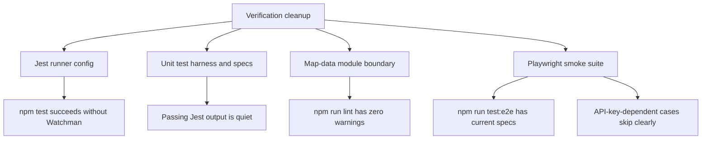

# test: Clean up verification workflow

## Summary

This plan hardens the project verification workflow so `npm test` runs without Watchman sandbox friction, the passing unit suite is quiet enough to trust, lint is warning-free, and Playwright has a lean smoke baseline that matches the current UI.

---

## Problem Frame

The latest project status showed healthy fundamentals: typecheck, lint, production build, and Jest all pass when Jest is run with `--watchman=false`. Three notes remain: plain `npm test` fails in the current sandbox because Watchman writes outside the workspace, passing tests emit substantial React and console noise, and Playwright infrastructure exists without checked-in specs.

These are developer-experience and confidence issues, not product-behavior changes. The work should keep the existing React 18, Vite 7, Jest, Testing Library, and Playwright stack intact.

---

## Requirements

### Unit Verification

- R1. `npm test` must run successfully in local sandboxed environments without requiring the caller to remember `--watchman=false`.
- R2. The Jest suite must not emit React `act(...)` warnings during passing tests.
- R3. Tests that intentionally exercise error or warning paths must suppress or assert expected console output locally, without hiding unexpected console noise globally.
- R4. The ts-jest `isolatedModules` deprecation warning must be resolved through the least invasive config change compatible with the current TypeScript setup.

### Lint and Module Boundaries

- R5. `npm run lint` must finish with zero warnings, including the current Fast Refresh warnings from mixed exports in the map-data hook module.
- R6. Production consumers must continue using the map-data provider and context path; any test-only hook exposure must stay isolated from the production component module.

### Browser Smoke Coverage

- R7. `npm run test:e2e` must discover at least one current Playwright spec instead of reporting an empty suite.
- R8. The E2E baseline must cover current, stable UI states and avoid resurrecting selectors or hooks called out as stale in `src/e2e/README.md`.
- R9. Browser tests that require a live Google Maps API key must skip clearly when the key is absent, rather than failing as infrastructure noise.
- R10. CI must remain predictable; Playwright should stay out of CI unless the plan also configures the required API key and runtime expectations.

---

## Key Technical Decisions

- KTD1. Disable Watchman in Jest config rather than relying on command-line flags. The failure is runner discovery, not an application test failure, and the stable fix belongs in `jest.config.js` so local, CI, and agent runs share the same behavior.
- KTD2. Fix noisy tests at the call sites instead of globally muting `console.error` or `console.warn`. Error-path tests should prove the UI behavior while explicitly acknowledging expected logs; a global mute would mask regressions.
- KTD3. Split test-only map-data access out of the Fast Refresh component module. The production module should export the provider and public hook, while tests import an internal hook from a separate non-component module to satisfy `react-refresh/only-export-components`.
- KTD4. Keep E2E coverage lean and API-aware. A small suite should always validate the app shell and missing-key error state, while map, layer-control, and search checks run only when a real Google Maps API key is available.
- KTD5. Keep Playwright excluded from CI for this pass. The existing workflow documents that CI lacks the required Google Maps API secret; changing that belongs to a separate rollout once the smoke suite is stable locally.

---

## High-Level Technical Design

---

## Scope Boundaries

### In Scope

- Make the existing verification commands more reliable and less noisy.
- Add a small current Playwright smoke suite.
- Update test documentation to match the new E2E baseline.
- Preserve existing app behavior and map data behavior.

### Deferred to Follow-Up Work

- Re-enable Playwright in CI after a `VITE_GOOGLE_MAPS_API_KEY` secret and expected browser matrix are agreed.
- Expand E2E coverage into the full checklist in `src/e2e/README.md`, including marker and region polygon interactions.
- Replace the broad Jest mocks in `src/setupTests.ts` with narrower per-test mocks unless that becomes necessary to eliminate the current warnings.

---

## Implementation Units

### U1. Make Jest Watchman-Free by Default

- **Goal:** Ensure `npm test` does not ask Watchman to write user-level state.
- **Requirements:** R1, R4
- **Dependencies:** None
- **Files:** `jest.config.js`, `package.json`, `tsconfig.app.json`, `tsconfig.node.json`
- **Approach:** Prefer Jest's `watchman: false` config so all invocations inherit the behavior. Resolve the ts-jest `isolatedModules` warning by moving the setting to the relevant TypeScript config if that is the supported path for the installed ts-jest version; otherwise keep the config change narrowly scoped and document why.
- **Patterns to follow:** Existing ESM Jest config in `jest.config.js`; current Vite env transformer comments in the same file.
- **Test scenarios:**
  - Running the default Jest command completes without the Watchman `fchmod` error.
  - Running the default Jest command no longer emits the ts-jest `isolatedModules` deprecation warning.
  - Existing `import.meta.env` tests in `src/App.test.tsx` still compile and pass through the transformer.
- **Verification:** `npm test -- --runInBand` passes without extra flags and without the Watchman or ts-jest warnings.

### U2. Quiet Expected Unit-Test Console Output

- **Goal:** Keep expected error-path logging from drowning out real test failures.
- **Requirements:** R2, R3
- **Dependencies:** U1
- **Files:** `src/hooks/useMapData.test.ts`, `src/App.test.tsx`, `src/components/TexasMap.test.tsx`, `src/setupTests.ts`
- **Approach:** Add local console spies around tests that intentionally trigger `console.error` or `console.warn`, and assert calls where the log is part of the intended behavior. Wrap manual mock callbacks and reload calls that trigger React state updates in `act` so tests observe React updates through supported boundaries.
- **Execution note:** Work characterization-first: run the focused noisy test files before editing so each warning has a mapped source.
- **Patterns to follow:** Existing console suppression around the polling-exhausted branch in `src/App.test.tsx`; existing `waitFor` usage in hook and map tests.
- **Test scenarios:**
  - A Head Start program fetch rejection sets `programsError` while the expected console error is locally captured.
  - A TXHSA region fetch rejection sets `regionsError` while the expected console error is locally captured.
  - A malformed region payload sets `regionsError` while the expected console error is locally captured.
  - The non-Error Google Maps API error case still shows the generic alert while the expected console error is locally captured.
  - Region layer click helpers open the expected info window without React `act(...)` warnings.
  - Manual `loadHeadStartPrograms` invocation remains covered without React `act(...)` warnings.
- **Verification:** The full Jest suite passes with no React `act(...)` warnings and no unsuppressed expected console output.

### U3. Remove Fast Refresh Lint Warnings from Map Data Exports

- **Goal:** Make lint warning-free while preserving the provider contract and hook testability.
- **Requirements:** R5, R6
- **Dependencies:** None
- **Files:** `src/hooks/useMapData.tsx`, `src/hooks/useMapDataInternal.ts`, `src/hooks/useMapData.test.ts`
- **Approach:** Move the internal map-data hook and related return type into a non-component module, then have `src/hooks/useMapData.tsx` export only the provider and public context hook. Update tests to import the internal hook from the new module.
- **Patterns to follow:** Existing comments in `src/hooks/useMapData.tsx` that distinguish provider-backed production usage from isolated hook testing.
- **Test scenarios:**
  - `MapDataProvider` still supplies a shared value to consumers of `useMapData`.
  - `useMapData` still throws when called outside the provider.
  - Existing isolated hook tests continue importing the internal hook and cover load, retry, and region-count behavior.
- **Verification:** `npm run lint` reports zero warnings and all existing map-data tests pass.

### U4. Add a Current, Lean Playwright Smoke Suite

- **Goal:** Restore checked-in E2E coverage without recreating the removed stale suite.
- **Requirements:** R7, R8, R9, R10
- **Dependencies:** U1
- **Files:** `src/e2e/app-smoke.spec.ts`, `playwright.config.ts`, `src/e2e/README.md`, `.github/workflows/ci.yml`
- **Approach:** Add smoke specs around stable current UI. Without a usable API key, verify the header and configured error state only. With a usable API key, also verify map initialization, data layer controls, default layer states, and search input/results behavior where it can be exercised without brittle Google Maps internals. Keep the browser matrix small for local smoke runs unless the existing broad matrix is intentionally retained with skip-aware tests.
- **Patterns to follow:** Current E2E README guidance; existing Playwright `webServer` block; CI comment explaining why E2E is omitted.
- **Test scenarios:**
  - With no API key, the header renders and the app shows the configured Google Maps API key error state.
  - With a valid API key, the app loads and the map container becomes visible.
  - Layer controls show Head Start Programs enabled and TXHSA Regions disabled by default.
  - Toggling TXHSA Regions updates the accessible pressed state.
  - Entering a search term shows search UI feedback without relying on stale selectors.
- **Verification:** `npm run test:e2e` discovers and executes the smoke suite; absence of an API key produces deterministic error-state coverage and skips only the key-dependent map interactions.

### U5. Update Verification Documentation

- **Goal:** Make the project docs match the cleaned-up verification workflow.
- **Requirements:** R1, R7, R9, R10
- **Dependencies:** U1, U4
- **Files:** `README.md`, `src/e2e/README.md`, `.github/workflows/ci.yml`
- **Approach:** Document that unit tests no longer require a Watchman workaround, describe the new E2E smoke scope, and keep CI language aligned with the decision not to run Playwright there yet.
- **Patterns to follow:** Existing README Testing section and `src/e2e/README.md` split between coverage guidance and run requirements.
- **Test scenarios:** Test expectation: none -- documentation-only changes.
- **Verification:** Documentation accurately describes the commands and caveats after U1-U4 are implemented.

---

## Risks & Dependencies

- **Google Maps API dependency:** Full browser validation of real map tiles and markers needs a valid API key. The E2E suite must skip or isolate key-dependent cases to avoid false failures.
- **Console suppression risk:** Over-broad console mocks can hide regressions. Each suppression should be local to the test and restored immediately.
- **Module split risk:** Moving `useMapDataInternal` can accidentally create a second data-loading path. Production imports should continue through `MapDataProvider` and `useMapData`.
- **Playwright matrix cost:** The current config runs six projects. A smoke suite may become slow if every check runs across all projects without a clear reason.

---

## Sources & Research

- `jest.config.js` currently configures ts-jest and can own `watchman: false`.
- `src/setupTests.ts` provides Google Maps and `@vis.gl/react-google-maps` mocks, including the `_fireClick` helper involved in region click warnings.
- `src/hooks/useMapData.test.ts`, `src/App.test.tsx`, and `src/components/TexasMap.test.tsx` contain the warning sources observed in the latest test run.
- `src/hooks/useMapData.tsx` currently exports provider, public hook, and test-only internal hook from one component-bearing module, causing Fast Refresh lint warnings.
- `src/e2e/README.md` documents why the previous E2E suite was removed and lists the future coverage targets.
- `.github/workflows/ci.yml` intentionally omits E2E until the suite and API-key secret are ready.
- `docs/solutions/architecture-patterns/txhsa-regions-overlay-lessons-2026-05-20.md` is adjacent context for map-data hook and overlay test fragility, especially around React hook state and Google Maps Data listener behavior.
